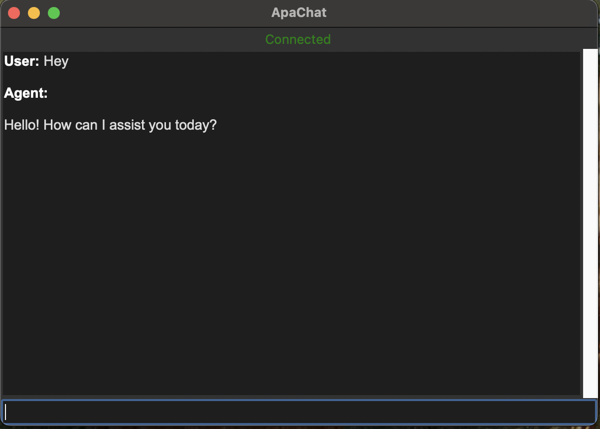
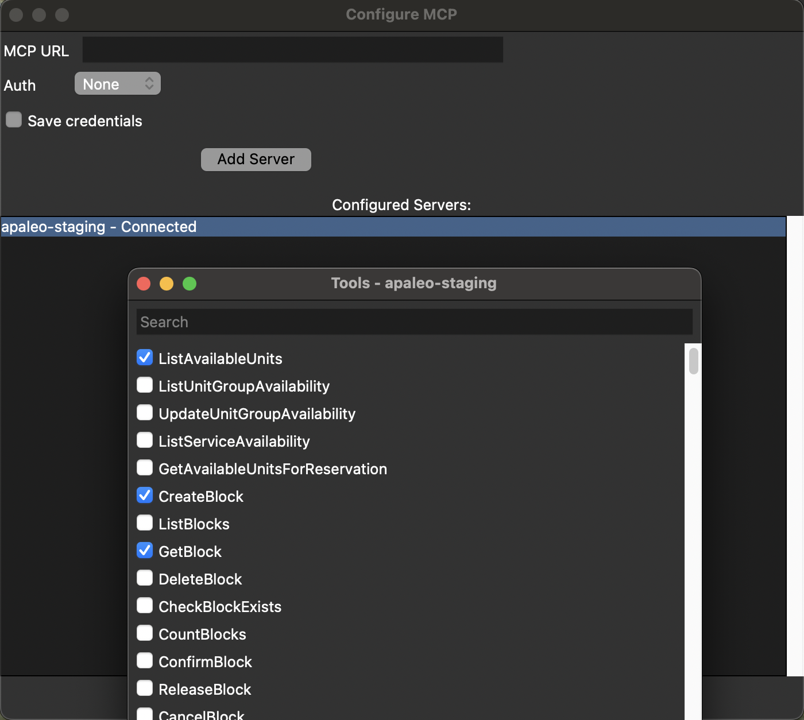
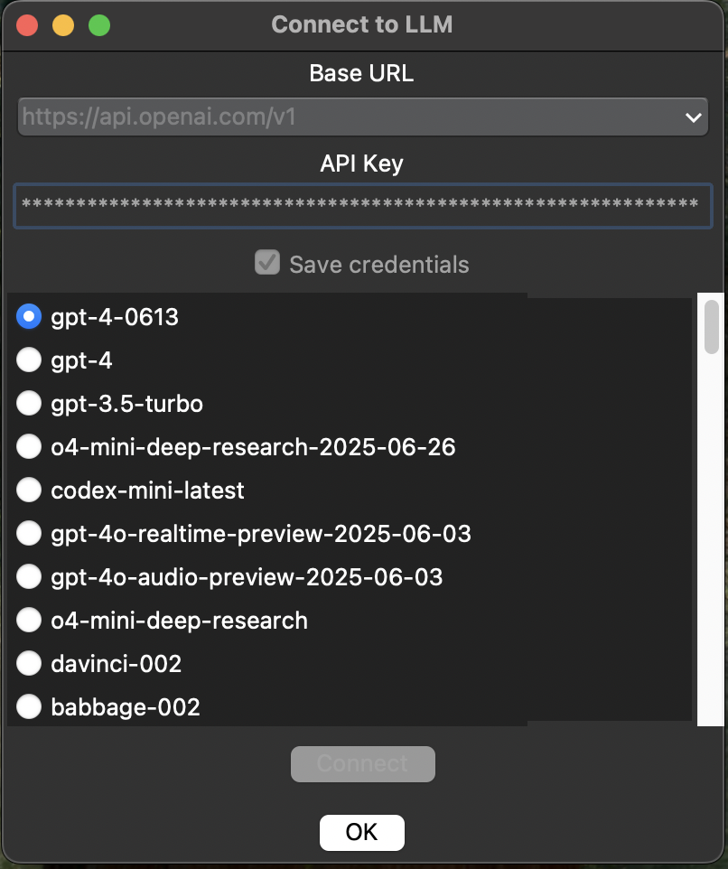

# ApaChat

**ApaChat** is a versatile chat application that allows users to connect to any LLM (Large Language Model) and any hosted MCP server, enabling dynamic interaction with both.

---

## 🧠 Main Features

- 🔌 Connect to LLM (OpenAI,  Openrouter, DeepSeek, etc.)
- 🌐 Connect to any MCP server
- 💬 Chat with the connected model via an intuitive UI
- 🧰 Select and use specific tools (API endpoints) from your MCP server

---

## 📸 Screenshots

### Chat Interface
The main interface to chat with your selected LLM:


---

### MCP Connection and Tool Selection
Configure your MCP server and select available tools:


---

### LLM Connection
Select your preferred language model and enter your API key:


---

## 🚀 Getting Started

### Requirements

Make sure the following Python packages are installed:

```bash
pip install requests mcp tkhtmlview markdown tkinter asyncio
```

> Note: On macOS, `tkinter` is usually pre-installed. On Linux, you might need to install it using your system's package manager (e.g., `sudo apt install python3-tk`).

### Run via Python

```bash
python main.py
```

### Or use the app bundle

Double-click the executable file `ApaChatApp.app` (on macOS).

---

## 🗃️ Project Structure

```
ApaChat/
├── Agent/
│   └── Agent.py
├── ChatInterface/
│   └── ChatInterface.py
├── LLM/
│   └── LLM.py
├── MCPClient/
│   └── MCPCLient.py
├── main.py
├── ApaChatApp.app
├── README.md
├── LICENSE
├── .gitignore
```

---

## 🔐 API Key Storage

You can choose to store your LLM and MCP credentials securely using your system’s keyring. This feature is fully optional.

---

## 📄 License

This project is licensed under the MIT License – see the [LICENSE](./LICENSE) file for details.